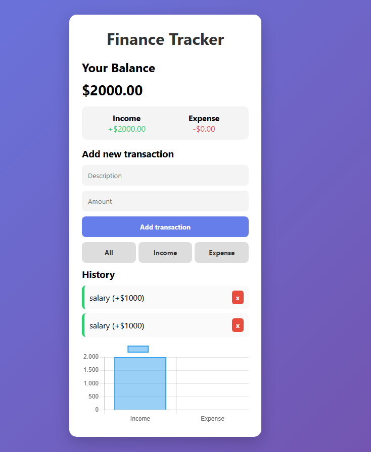

# 💰 Finance Tracker

A modern and responsive **finance tracking web app** built with JavaScript.
It allows users to manage income and expenses, visualize financial data, and persist information locally.

---

## 🚀 Live Demo

🔗 https://susimplicia.github.io/Finance-tracker/

---

## 📸 Preview


---

## ✨ Features

* ➕ Add new transactions (income & expense)
* ✏️ Edit existing transactions
* ❌ Delete transactions
* 📊 Visual chart for financial overview
* 🌙 Dark mode toggle
* 🔍 Filter transactions (all / income / expense)
* 💾 Data persistence using LocalStorage
* 📱 Responsive design

---

## 🛠️ Technologies Used

* HTML5
* CSS3
* JavaScript (Vanilla JS)
* Chart.js

---

## 📂 Project Structure

```
finance-tracker/
│
├── index.html
├── style.css
├── script.js
└── README.md
```

---

## 🧠 What I Learned

* DOM manipulation with JavaScript
* Managing application state
* Using LocalStorage for data persistence
* Creating interactive charts with Chart.js
* Implementing dark mode and UI improvements
* Structuring a front-end project

---

## 🚀 How to Run Locally

1. Clone the repository:

```bash
git clone https://github.com/Susimplicia/Finance-tracker.git
```

2. Open the project folder

3. Run `index.html` in your browser

---

## 📌 Future Improvements

* User authentication
* Backend integration
* Data export (CSV/PDF)
* Improved UI/UX animations
* Mobile-first design enhancements

---

## 👩‍💻 Author

Developed by **Suyane Simplícia Faria Silva**

---

## ⭐ If you like this project

Give it a ⭐ on GitHub — it helps a lot!
